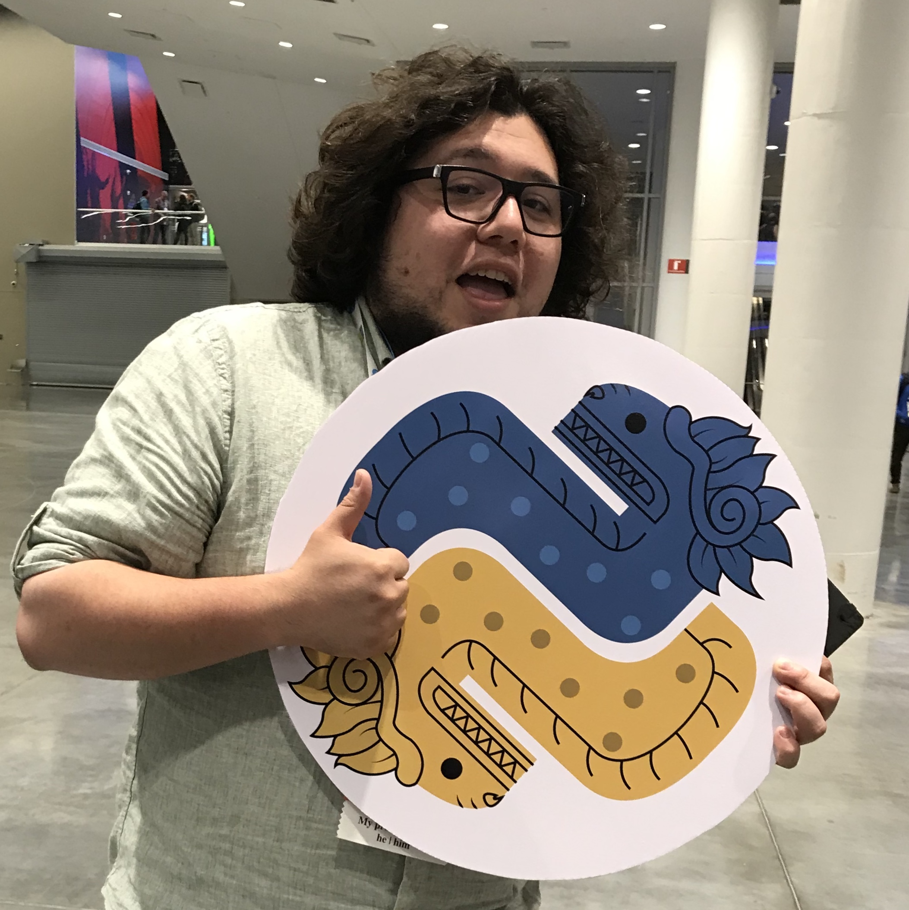

La semana pasada Cleveland, Ohio fue el lugar más mágico del planeta por una razón: PyCon US 2019. 

<figure>

<figcaption style="text-align:center"><i>♥️🇨🇴🇲🇽🇪🇸🇳🇮🇵🇷🇩🇴♥️</i></figcaption>
</figure> 

Este año tuve la oportunidad de atender una PyCon por primera vez. Para quien no sepa: PyCon (de _Python Conference_) es una conferencia anual atendida por personas de **todo** el mundo. Conocí gente de Colombia, Argentina, Brasil, Nicaragua, España, República Dominicana, Puerto Rico, Australia, Siria, y muchos otros paises los 4 días que estuve ahí. 

Pero más que compartir mi experiencia personal quiero compartir rápidamente 3 cositas:

1. `Python` tiene un sinfín de aplicaciones 
    En las #PyConCharlas tuve la oportunidad de aprender de profesionales que utilizan `python` en campos que jamás hubiera imaginado. Resolviendo crímenes en Argentina, vigilando al gobierno en Brasil, creando geometrías fantásticas, y muchas otras cosas más. Les recomiendo ver estas charlas ya que todo esta en YouTube. ¡Son de 20-25 minutos! 
    <iframe width="560" height="315" src="https://www.youtube.com/embed/tTIWVfltBbk" frameborder="0" allow="accelerometer; autoplay; encrypted-media; gyroscope; picture-in-picture" allowfullscreen></iframe>

2. Mi tutorial de Pandas está disponible en español 
    PyCon se encarga de publicar **todas** las platicas en YouTube para que, aunque no hayas ido, todos tengan acceso a este conocimiento. Esto incluye los tutoriales. Esto se me hace increíble ya que para entrar a estos tutoriales tenías que pagar $150. Aún así todo esto esta disponible de manera gratuita en YouTube. Aquí esta mi tutorial en inglés:
    <iframe width="560" height="315" src="https://www.youtube.com/embed/sGtCgYWzOV4" frameborder="0" allow="accelerometer; autoplay; encrypted-media; gyroscope; picture-in-picture" allowfullscreen></iframe>

    ¡Y también traduje el tutorial a español! Si quieres seguir el tutorial en tu propio navegador puedes visitar [bit.ly/DATOS-CENSALES-PYCON2019](https://bit.ly/DATOS-CENSALES-PYCON2019). El repositorio de GitHub se encuentra por acá -> https://github.com/chekos/analizando-datos-censales

3. ¡PyCon Latinoamérica viene este agosto a México! 
     
    El último día para proponer una charla es el 31 de mayo. Si quieres aprender más de `python` o visitar Puerto Vallarta o ambos, ve a [pylatam.org](https://pylatam.org/) para reservar tus boletos y a [papercall.io/pyconlatam](https://papercall.io/pyconlatam) para proponer una charla.

Para terminar, quiero agradecerle a todos y cada una de las personas que hacen **tacosdedatos** posible. Acabamos de llegar a 1000 seguidores en twitter. Esta es una comunidad increíble de gente amable, curiosa, y, como decimos en México, chingona. Todas las personas que conocí en PyCon son increíbles. Todas las personas con las que he interactuado _online_ a través de @tacosdedatos son increíbles. 

Y con eso me despido. Tómense un tiempo para ver las PyCon Charlas y [¡envíen un tuit agradeciendoles el trabajo que hacen!](https://twitter.com/share?text=+%pyconcharlas+muchas+gracias+)

Cuéntanos que piensas en un [tuit](https://twitter.com/share?text=%40tacosdedatos+yo+tambien+quiero+ir+a+pycon+latam+%40pylatam). 
¿Tienes ideas o sugerencias sobre que más deberíamos cubrir en **tacosdedatos**? Envianos un correo a [✉️ sugerencias@tacosdedatos.com](mailto:sugerencias@tacosdedatos.com?subject=Sugerencia&body=Hola-holaaa).