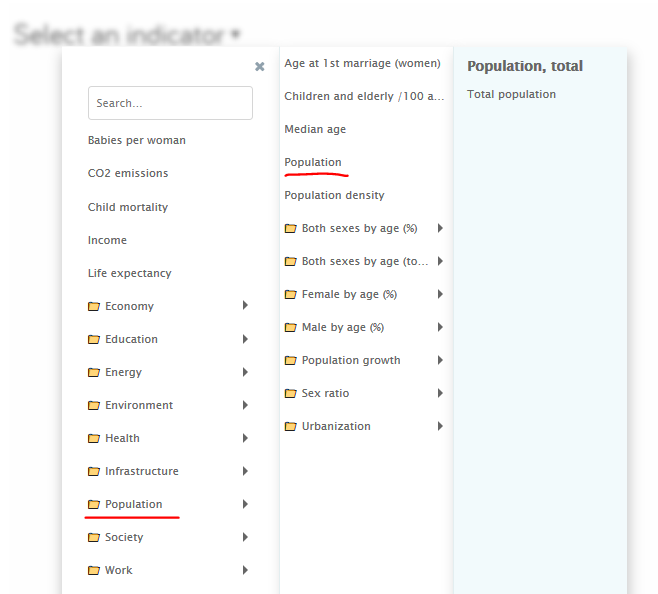
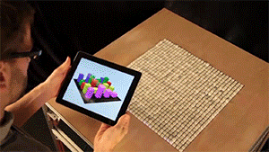

Crear la animación de la "bar chart race" en R con gganimate y ggplot


¡Hola Mundo! En este tutorial vamos a hacer una animación o GIF llamada "bar chart race". Es posible que ya la hallas visto aquí. En esta entrada, vamos a hacer una versión con R y gganimate en español.

Los datos que utilizaremos contienen la población de LatinoAmérica y España desde el siglo pasado. Vamos a visualizar el top de países por población a lo largo de los años.

### Pre-requisitos
Es deseable que tengas un conocimiento básico de funciones en R, gráficas en ggplot2, datos tidy y el paquete tidyverse. Sin embargo, puedes utilizar el código en R para obtener la gráfica.

## Pasos para crear bar chart race
1. Descarga de datos de gapminder
2. Preparación de datos para la gráfica
3. Visualización de carrera de barras
4. Animación de visualización

## 1. Descarga de datos de gapminder

Para empezar, puedes ir a la página de gapminder. Ahí, bajamos hasta el menú para seleccionar un indicador. Luego, vamos a "Population" y seleccionamos "population, total". Por último, escogemos la opción de csv.



Para cargar el csv en R, guardamos el archivo descargado en la carpeta de trabajo. Además, cargamos las librerías que vamos a utilizar en todo el proceso. Luego, podemos utilizar el siguiente código:

```r
# descargar datos en https://www.gapminder.org/data/

# escribir la ruta de los datos
path_to_data <- './population_total.csv'

# leer archivo csv
population_data <- read_csv(path_to_data)
```

Nota: En R, existe el paquete gapminder con datos similares. La diferencia con los datos que estamos utilizando en este tutorial es que estos vienes espaciados cada año. Mientras que los que vienen en el paquete de R vienen cada 5 años.

## 2. Preparación de datos para la gráfica

Para utilizar ggplot con efectividad, necesitamos que los datos estén en [formato "tidy" o datos ordenados](https://es.r4ds.hadley.nz/datos-ordenados.html).
Para esto, tenemos que seguir una serie de pasos sobre la tabla que tenemos en R. En particular, aplicamos los pasos que se explican en el código.

```r
# crear datos tidy u ordenados
population_tidy <- population_data%>%
  # filtrar para algunos paises de HispanoAmérica
  filter(country %in% c('Argentina',
                        'Chile',
                        'Colombia',
                        'Ecuador',
                        'Mexico',
                        'Panama',
                        'Peru',
                        'Spain',
                        'Uruguay',
                        'Venezuela')) %>%
  # juntar años el filas o renglones
  gather(key = year, value = population, -1) %>%
  # mutar años como entero y población en millones
  mutate(year = as.integer(year),
         population10 = population/1000000) %>%
  # filtrar por años
  filter(year > 1940,
         year < 2020) %>%
  # agrupar y crear ranking para ordenar
  group_by(year) %>%
  mutate(ordering = min_rank(population10) * 1.0) %>%
  ungroup() %>%
  # filtrar primeros 5 paises por año
  filter(ordering >= 6)
```

Ahora viene la parte divertida!


## 3. Visualización de la carrera de barras

El "truco" para hacer la carrera de barras es utilizar geom_tile en lugar de geom_bar para generar las barra. Esto da un efecto fluido cuando las barras cambian de lugar. Como lo muestra [este post de StackOverflow](https://stackoverflow.com/questions/52623722/how-does-gganimate-order-an-ordered-bar-time-series/52652394#52652394).

Siguiendo este código podrás obtener el objeto gráfico de ggplot:

```r
# hacer objeto de grafica
p <- population_tidy %>%
  ggplot(aes(ordering, group = country)) +
  # utilizar geom_tile en lugar de geom_bar
  geom_tile(aes(y = population10/2,
                height = population10,
                width = 0.9, fill=country), alpha = 0.9) +
  # texto en las barras
  geom_text(aes(y = population10, label = paste(as.character(round(population10)), 'M')),
            vjust = 0.4, hjust = 0.55, size = 7) +
  geom_text(aes(y = 0, label = country),
            vjust = 0.4, hjust = 0.0, size = 7) +
  # nombres
  labs(title = paste("Población Año ",
                     '{closest_state}', sep=""),
       subtitle = 'Para paises de habla hispana',
       x = '', y = '') +
  # para que las barras sean horizontales
  coord_flip(clip = 'off') + # clip = 'off' para sacar texto de márgenes
  # modificando algunos elementos del tema principal
  theme(plot.title = element_text(size = 22),
        plot.subtitle = element_text(size = 16),
        axis.ticks.x = element_blank(),
        axis.text.x  = element_blank(),
        axis.ticks.y = element_blank(),
        axis.text.y  = element_blank(),
        legend.position = "none")
```

## 4. Animación de visualización

El paquete gganimate te permite realizar distintos tipos de animaciones. En este caso utilizamos transition_states porque queremos ver el cambio en los años (estados) de nuestros datos. Para esto utilizamos el código

```r
# crear animación
anim <- p +
  # animacion con cambios en los estados del año
  transition_states(year,
                    transition_length = 1,
                    state_length = 0,
                    wrap = FALSE) +
  # permitir que los ejes cambien
  view_follow()
```

Finalmente, podemos crear el gif utilizando la función animate(). Los parámetros escogidos se explican en el código.

```r
# animando
anim %>% animate(fps = 30,
                 nframes = 300,
                 detail = 10,
                 start_pause = 30,
                 end_pause = 30,
                 rewind = FALSE,
                 width = 400,
                 height = 400)

# guardar animacion en formato gif
anim_save('bar_race_population.gif')
```

El gif que obtenemos es el siguiente:


## Conclusiones

En esta entrada vimos como crear la "carrera de las barras". Espero que con este tutorial puedas agregar este tipo de gráficas a tu catálogo o portafolio de datos.



Si te ha gustado este tutorial, te recomiendo que intentes ir un poco más allá cambiando el fondo y los temas de ggplot. Puedes saber sobre [como cambiar los temas de ggplot en este articulo](https://tacosdedatos.com/ggplot2-mas-bbc-es-igual-a-bbplot). Envíame [un twit aquí](https://twitter.com/gonzalezgouveia) si lo has logrado!

Puedes mostrar tus resultados en iniciativas como #datosdemiercoles en Twitter. Es [un  evento](https://github.com/cienciadedatos/datos-de-miercoles) donde puedes subir tus gráficos hechos en ggplot y compartirlos con la comunidad de R en español. Este proyecto es una iniciativa de [R4DS_es en twitter](https://twitter.com/R4DS_es).

Si quieres ver como hacer otro tipo de animación en R, he escrito [otro artículo](https://medium.com/datos-y-ciencia/c%C3%B3mo-hacer-un-gif-en-r-con-ggplot-gganimate-b68f234436af) donde explico como hacer una scatterplot o gráfica de dispersión animada con las banderas de los países de habla hispana.

Estoy atento a los comentarios por si tienes alguna pregunta o sugerencia!

Te mando un saludo donde quiera que estes!

### Recursos en inglés

[https://emilykuehler.github.io/bar-chart-race/](https://emilykuehler.github.io/bar-chart-race/)

https://github.com/ropenscilabs/learngganimate/blob/2872425f08392f9f647005eb19a9d4afacd1ab44/animate.md#saving-your-animation

https://observablehq.com/@johnburnmurdoch/bar-chart-race-the-most-populous-cities-in-the-world


